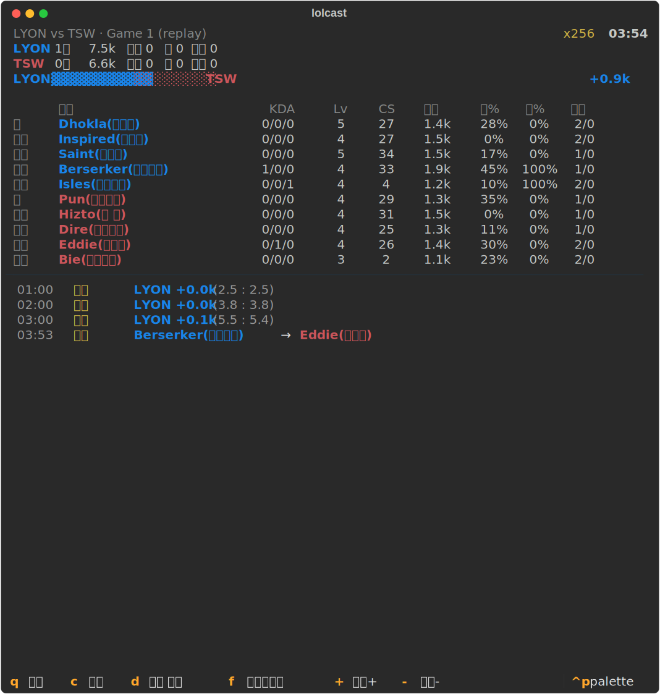

# lol-cast-cli


LoL 이스포츠 국제대회(**First Stand / MSI / Worlds**)를 터미널에서
스포츠 텍스트 중계처럼 보는 인터랙티브 CLI.

> 스레드 [@wjda.lswjdals](https://www.threads.com/@wjda.lswjdals) 님 글에서 영감을 받아,
> 2026-07-08 T1 경기를 보기 위해 급하게 만들었다. 🏃

<p align="center">
  
</p>

## 설치

Linux / macOS / Windows, Python 3.10+
(Windows는 [Windows Terminal](https://aka.ms/terminal) 권장)

```bash
# uv (권장)
uv tool install git+https://github.com/wavewwave20/lol-cast-cli.git

# 또는 pipx
pipx install git+https://github.com/wavewwave20/lol-cast-cli.git
```

업데이트는 언제든:

```bash
lolcast update
```

## 사용법

```bash
lolcast
```

이게 전부다. 홈에서 경기를 고르면 라이브 중계 또는 리플레이가 시작된다.

| 화면 | 키 |
|---|---|
| 홈 | `↑↓` 이동 · `Enter` 선택 · `r` 새로고침 · `q` 종료 |
| 세트 선택 | `↑↓`/숫자키 · `Enter` 재생 · `q` 뒤로 |
| 중계 | 휠/`↑↓`/`PgUp` 스크롤 · `d` 선수 상세 · `f` 자동스크롤 · `+`/`-` 배속 · `q` 뒤로 · `c` 종료+클리어 |

바로가기:

```bash
lolcast watch                          # 라이브 경기로 바로
lolcast replay T1 --speed 20 --game 2  # 리플레이로 바로
lolcast schedule                       # 일정만 출력
```

## 기능

- **라이브 중계** — 진행 중 경기 자동 감지, 세트 끝나면 다음 게임 자동 전환
- **리플레이** — 끝난 경기를 처음부터 배속 재생 (`+`/`-`로 1~256배속)
- **이벤트 피드** — `킬` `퍼블` `처형` `용` `바론` `타워` `억제기` `골드`(60초마다) `종료/중지/재개`
  - 킬러/희생자는 팀 색으로, 챔피언명은 한글로 (Data Dragon)
- **선수 상세** (`d`) — 10명 전원 KDA · 레벨 · CS · 골드 · 딜 지분 · 킬 관여율 · 와드
- **터미널 네이티브** — 배경/전경색은 터미널 테마를 그대로 따라간다

```
T1 vs FUR · Game 1                                             32:43
T1   11킬    62.7k   타워 7   용 3  바론 0
FUR   7킬    52.6k   타워 1   용 2  바론 0
T1 ▓▓▓▓▓▓▓▓▓▓▓░░░░░░░░░ FUR                                   +10.2k
─────────────────────────────────────────────────────────────────────
 24:21  용      T1 바다 드래곤 (2스택)
 30:31  퍼블    Peyz(신드라) → JoJo(렐)
 32:33  억제기  T1 억제기 파괴 (1번째)
 33:53  종료    게임 종료
```

## 동작 방식

lolesports.com이 실제로 쓰는 비공식 API를 폴링한다:

- persisted API — 일정 / 매치 / 세트 정보
- livestats 피드 — 10초 윈도우, 초당 ~4프레임 (골드 / KDA / 오브젝트)
- 순수 함수 diff 엔진이 프레임을 비교해 이벤트 추출 → [Textual](https://github.com/Textualize/textual) TUI 렌더링

## 개발

```bash
git clone https://github.com/wavewwave20/lol-cast-cli.git && cd lol-cast-cli
uv sync
uv run pytest                            # diff 엔진은 실경기 픽스처로 검증
uv run lolcast replay T1 --speed 100
```

```
src/lolcast/
├── api.py     # API 클라이언트 (백오프, 204 처리, ddragon 한글명)
├── events.py  # 프레임 diff 엔진 (순수 함수)
├── render.py  # 피드/스코어보드/선수 상세 렌더링
├── app.py     # Broadcaster + 리플레이/라이브 공급 루프
├── tui.py     # Textual TUI (홈/세트선택/중계)
└── cli.py     # 진입점
```

## 주의

비공식 API 사용 — Riot이 예고 없이 바꾸면 깨질 수 있다.
Riot Games와 무관한 팬 프로젝트.

## License

MIT
